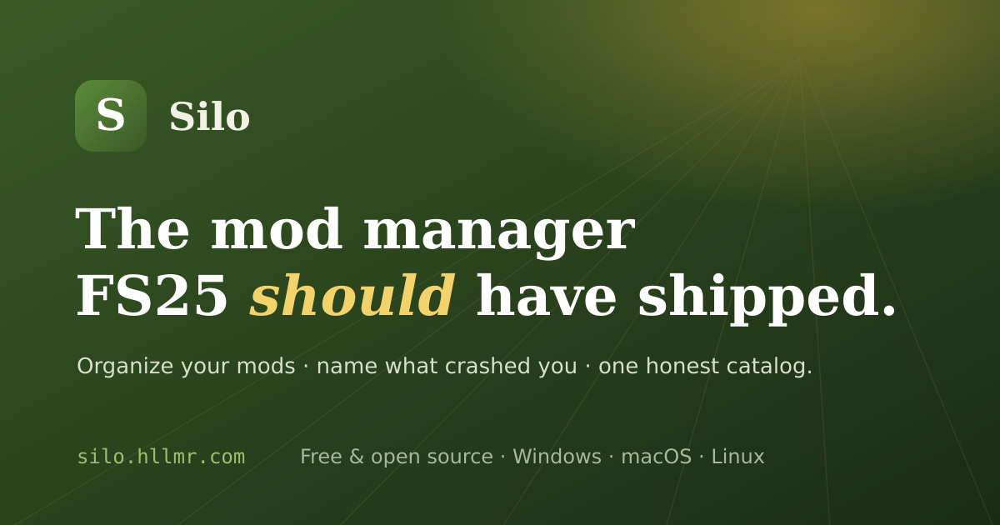

<p align="center">
  
</p>

<h1 align="center">Silo</h1>

<p align="center"><em>The mod manager Farming Simulator 25 should have shipped with.</em></p>

<p align="center">
  <a href="https://github.com/HLLMR/silo/releases/latest"></a>
  <a href="https://github.com/HLLMR/silo/actions/workflows/ci.yml"></a>
  <a href="LICENSE"></a>
  
  <a href="https://github.com/HLLMR/silo/releases"></a>
  <a href="https://silo.hllmr.com"></a>
</p>

A fast, native desktop app for your FS25 mod library. Silo reads the game log to name
the mod that crashed you, flags conflicts before you launch, and shows the latest
version it can find across ModHub, GitHub and Nexus. Everything it changes on disk is
reversible. **Free and open source. Windows · macOS · Linux.**

<p align="center">
  <b><a href="https://github.com/HLLMR/silo/releases/latest">⬇ Download the beta</a></b>
  &nbsp;·&nbsp; <a href="https://silo.hllmr.com">silo.hllmr.com</a>
  &nbsp;·&nbsp; <a href="#install">Build from source</a>
</p>

> **Status: public beta.** Builds are unsigned (open source), so Windows SmartScreen /
> macOS Gatekeeper may warn on first launch.

## Why

FS25 reads one flat `mods/` folder, so everything you own is always active at once. When
something breaks, the game won't tell you what. There's no conflict detection, no
organization, no honest update tracking, no way to define a loadout per savegame. Silo
is the management layer the game left out.

## What it does

- **Crash & log triage** — parses `log.txt`, separates real errors from cosmetic noise,
  and names the mod at fault.
- **Conflict detection** — duplicate active maps (an instant crash), plus colliding
  filltypes, vehicle types and scripts across your active set.
- **Cross-source catalog** — one record per mod aggregating ModHub + GitHub + Nexus,
  with the latest version found across all of them (backed by
  [SiloAPI](https://silo-api.hllmr.com)).
- **Guided bisection** — when the log can't name the culprit, automates "disable half,
  relaunch" to isolate it, and safely restores your active set afterward.
- **Loadouts & projection** — curate profiles and project only the active set into the
  game's flat folder at launch, via symlink/junction — never by moving your files.
- **Per-source actions** — star a repo on GitHub, endorse on Nexus, rate on ModHub, all
  through *your own* accounts. Silo just opens the door; your credentials stay yours.
- **Multiplayer sync**, a **filltype-compatibility bridge generator**, **savegame backup**,
  and a full **control-binding map**.

## Install

**Download:** grab the installer for your OS from
[Releases](https://github.com/HLLMR/silo/releases). Builds are unsigned (open source), so
Windows SmartScreen / macOS Gatekeeper may warn on first launch.

**Build from source:** needs [Rust](https://rustup.rs) + [Node 20+](https://nodejs.org)
and the [Tauri v2 prerequisites](https://v2.tauri.app/start/prerequisites/) for your OS.

```bash
npm ci
npm run tauri:dev     # run in dev
npm run tauri:build   # produce an installer in src-tauri/target/release/bundle/
```

## Trust

- **Open source** — the desktop app is fully open here; audit, fork, or build it yourself.
- **No telemetry, no account** — Silo uses the network only for catalog search, update
  checks, and the source actions you choose.
- **Reversible by design** — it files your mods into a local archive and links the active
  set into the game; every move is recorded and undoable, and it backs up before any
  overwrite.

## Stack

Tauri v2 (Rust core, all heavy work off the UI thread) + Svelte 5 + TypeScript, SQLite
cache (path + mtime + size), quick-xml parsing. See [`docs/`](docs/) —
`ARCHITECTURE.md`, `MVP.md`, and per-feature notes.

## Contributing

Issues and PRs welcome. `npm run check` (svelte-check) and `cargo test` (in `src-tauri/`)
must pass — CI runs both. Please keep heavy work off the UI thread and file writes
reversible (see [`CLAUDE.md`](CLAUDE.md) for conventions).

## License

[MIT](LICENSE) © HLLMR. Use it, fork it, ship it.

---

_Not affiliated with GIANTS Software. Farming Simulator is a trademark of its respective
owner._
